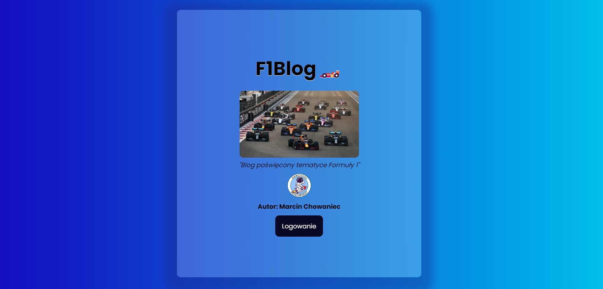
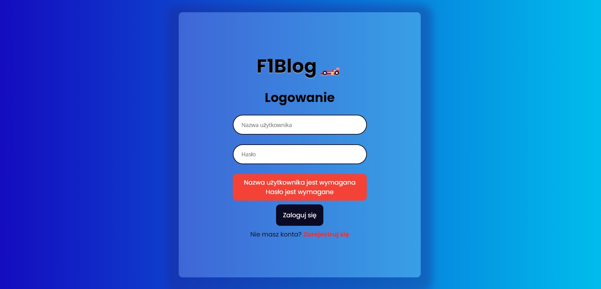
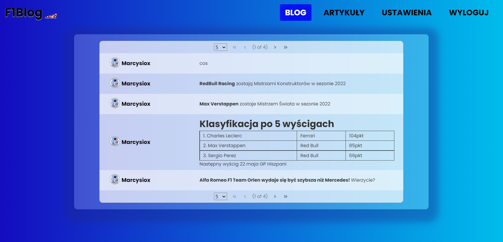

# JEE F1Blog
App for Formula 1 fans. Include register, login, logout, articles, blog, settings for user.
Admin can add new formula 1 race winner and text on blog. 

## Technologies
* JavaEE + JSF and EJB as backend technologies
* Wildfly 18.0.1 on Mojarra as server
* PrimeFaces to generate view
* MySQL PHP MyAdmin

 

 

 

